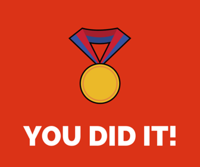

### Ignition: What's Next?

####Congratulations! You've built your first website! 

What can we do next?

**Recommended**: Put your website live on the web for FREE with Github [Pages](https://pages.github.com/)! (Requires Github Account)

There's a whole wide world of content to learn and master. I hope you had fun learning the basics of websites and web design, and would love to see the work that you produce! I'll happily retweet your work and add your page to a student gallery, just leave a comment on this project.

Without further ado, here some things to explore after finishing your first basic website.

#### Working list of tracks
+ **Design**
    + **Principles** - 31. "Good design adds value faster than it adds cost."- Thomas C. Gale
        + DRY and KISS
        + User Interface Design
        + User Experience Research and Documentation
        + Writing Personas and Case Studies
    + In Practice
        + Responsive Design (Screen Sizes and Asset Delivery)
        + Design Prototyping
        + Mockups and Wireframing : on paper or with software
+ **Productive Coding** - Write faster and more accurately!
    + Typing workflow with Sublime Text 3 Plugins (Emmett etc)
    + Type Faster with [keybr](http://www.keybr.com/)
    + Scaffolding Grid Frameworks: Bootstrap and Foundation
    + Tooling Workflows with Gulp and Grunt
+ **Site Performance** - Speed is a feature!
    + Pagespeed Insights
    + File compression and server optimization
+ **Coding in Teams**
    + Establishing Styleguides - _"Always code as if the guy who ends up maintaining your code will be a violent psychopath who knows where you live." - Martin Golding"_
    + Commenting Conventions
    + Validing code and style with JsHint and JSCS
    + Using Github and Version Control
    + Common development environments with Vagrant and Docker
+ **Code Preprocessors**
    + **CSS**: Sass, Less, and Stylus
    + **JS**: CoffeeScript
    + **HTML**: Jade, Haml, etc
    + **JSON**: YML, etc
+ Application Development
    + Take a intro programming course via [Stanford Online](https://lagunita.stanford.edu/courses/Engineering/CS101/Summer2014/about) or [Free Code Camp](http://www.freecodecamp.com/)
    + Learn **Server-Side** Code (PHP, Ruby, Python, NodeJS)
    + Learn a **Query Language** with a Database (SQL, Mongo, MySQL)
    + Learn a **framework** (Flask, Ruby on Rails)
    + **Package and Dependency Management**: nodeJS and NPM, Bower
    + Fun with **external JS libraries**: "Importing jQuery to add a couple of classes is like throwing a Masterball to catch a Magikarp." - aimdevloper

    _Work in Progress: Expanded regularly_

[Additions](http://cameronyick.us/resources)

###[Back to Home](overview.md)
